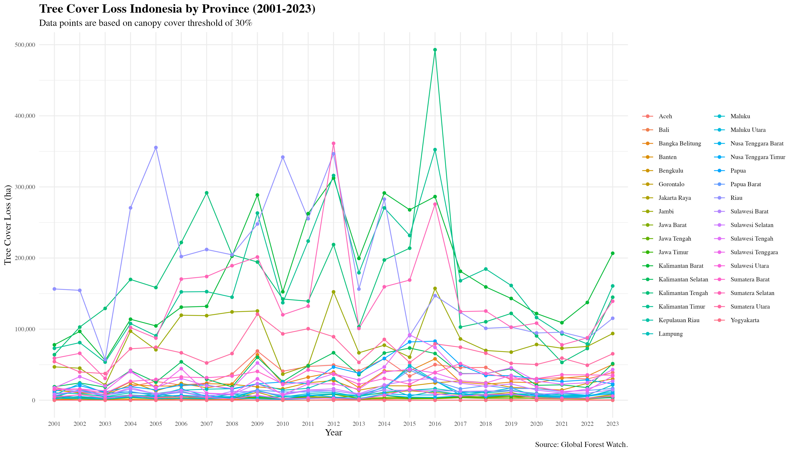

```{r setup, include=FALSE, message = FALSE, warning = FALSE}
options(repos = c(CRAN = "https://cloud.r-project.org"))
```


## Background

Indonesia boasts the third largest forest in the world, home to a rich biodiversity ecosystem (Greenpeace, n.d.). However, recent news suggests that big corporations are planning to remove the forest in Papua, where indigenous people depend on and protect its natural resources, to make way for palm oil plantations (Greenpeace Southeast Asia, 2024). This news raises questions about the current condition of Indonesia’s forest and how it has changed over the years.


## Data Source

To address my concerns, I found the Global Forest Watch (GFW) website that provides data on Indonesia's annual tree cover loss from 2001-2023. The data is accessible via the following link: https://www.globalforestwatch.org/dashboards/country/IDN/?category=land-cover&location=WyJjb3VudHJ5IiwiSUROIl0%3D&map=eyJjYW5Cb3VuZCI6dHJ1ZX0%3D. 

The data was generated by the University of Maryland's GLAD laboratory in collaboration with Google (Hansen et al. 2013). GFW refers tree cover loss as a “stand replacement disturbance” that entails at minimum of 50% tree cover removal within a 30-meter pixel. I selected two sheets from the Excel file that display the tree cover data: Country tree cover loss and Subnational 1 tree cover loss.

The following are the descriptions of each sheet from the GFW data:
Country tree cover loss: Hectares of tree cover loss at a national level, between 2001-2023, categorized by percent canopy cover in 2000. 
Subnational 1 tree cover loss: Hectares of tree cover loss at the first sub-national level, between 2001-2023, categorized by percent canopy cover in 2000. 

Note: 
Canopy cover (CC) is the percentage of ground that individual tree crowns cover. This is measured based on the vertical projection of the tree crown’s perimeter onto a horizontal plane (van Laar and Akça, 2007). A 100% CC indicates that the area is fully covered, whereas a 0% CC indicates a canopy gap, basic open area, or forest opening that allows sunlight to reach plants that may grow closer to the ground (Vatandaslar et al., 2024).


## Research Question

From examining the sheets, I developed two research questions, which are:
*** 1. What are the magnitudes of tree cover loss per year in Indonesia from 2001 to 2023?*** 
*** 2. What are the magnitudes of tree cover loss per year in each province from 2001 to 2023?***


## Data Preparation

Since the data are in wide format on both sheets, I converted them to long format and input the year as a factor before visualising it. GFW uses the 30% canopy cover threshold as a default for analysis, so I filtered the tree cover loss numbers within this threshold for the ‘Subnational 1 tree cover loss’ data.

```{r, message=FALSE, warning=FALSE, eval=FALSE}
## install packages for data preparation ##
install.packages("readxl")
install.packages("writexl")
install.packages("reshape2")
install.packages("dplyr")

## install packages to make scatter plot) ##
install.packages("ggplot2")
install.packages("RColorBrewer")

## install a package to make interactive plot ##
install.packages("plotly")
```


```{r, message=FALSE, warning=FALSE}
#set directory % load the packages
library(here)
library(readxl)


#import data from excel & promtply check the data using head() function
country_tc_loss_wide <- read_excel("IDN.xlsx", sheet = "Country tree cover loss")
head(country_tc_loss_wide)

subnational_tc_loss_wide <- read_excel("IDN.xlsx", sheet = "Subnational 1 tree cover loss")
head(subnational_tc_loss_wide)

#convert the wide data format to long data format
library(reshape2)

country_tc_loss_long <- melt(country_tc_loss_wide, 
                             id.vars = c('country', 'threshold', 'area_ha', 
                                         'extent_2000_ha', 'extent_2010_ha', 
                                         'gain_2000-2020_ha'), 
                             measure.vars=c('tc_loss_ha_2001','tc_loss_ha_2002', 
                                            'tc_loss_ha_2003', 'tc_loss_ha_2004', 
                                            'tc_loss_ha_2005', 'tc_loss_ha_2006',
                                            'tc_loss_ha_2007', 'tc_loss_ha_2008', 
                                            'tc_loss_ha_2009', 'tc_loss_ha_2010', 
                                            'tc_loss_ha_2011', 'tc_loss_ha_2012',
                                            'tc_loss_ha_2013', 'tc_loss_ha_2014', 
                                            'tc_loss_ha_2015', 'tc_loss_ha_2016', 
                                            'tc_loss_ha_2017', 'tc_loss_ha_2018', 
                                            'tc_loss_ha_2019', 'tc_loss_ha_2020', 
                                            'tc_loss_ha_2021', 'tc_loss_ha_2022', 
                                            'tc_loss_ha_2023'),
                             variable.name = 'year_tc_loss',
                             value.name = 'tc_loss')

#change the column "year" from character to numerical
levels(country_tc_loss_long$year_tc_loss)
levels(country_tc_loss_long$year_tc_loss) <- c("2001", "2002", "2003", "2004", 
                                               "2005", "2006", "2007", "2008", 
                                               "2009", "2010", "2011", "2012", 
                                               "2013", "2014", "2015", "2016", 
                                               "2017", "2018", "2019", "2020", 
                                               "2021", "2022", "2023")

head(country_tc_loss_long)  #quick check of the wrangled data


#now to transform the subnational data
subnational_tc_loss_long <- melt(subnational_tc_loss_wide, 
                             id.vars = c('country', 'subnational1', 'threshold',
                                          'area_ha','extent_2000_ha', 'extent_2010_ha', 
                                          'gain_2000-2020_ha'), 
                             measure.vars=c('tc_loss_ha_2001','tc_loss_ha_2002', 
                                            'tc_loss_ha_2003', 'tc_loss_ha_2004', 
                                            'tc_loss_ha_2005', 'tc_loss_ha_2006',
                                            'tc_loss_ha_2007', 'tc_loss_ha_2008', 
                                            'tc_loss_ha_2009', 'tc_loss_ha_2010', 
                                            'tc_loss_ha_2011', 'tc_loss_ha_2012',
                                            'tc_loss_ha_2013', 'tc_loss_ha_2014', 
                                            'tc_loss_ha_2015', 'tc_loss_ha_2016', 
                                            'tc_loss_ha_2017', 'tc_loss_ha_2018', 
                                            'tc_loss_ha_2019', 'tc_loss_ha_2020', 
                                            'tc_loss_ha_2021', 'tc_loss_ha_2022', 
                                            'tc_loss_ha_2023'),
                             variable.name = 'year_tc_loss',
                             value.name = 'tc_loss')

levels(subnational_tc_loss_long$year_tc_loss)
levels(subnational_tc_loss_long$year_tc_loss) <- c("2001", "2002", "2003", "2004", 
                                                   "2005", "2006", "2007", "2008", 
                                                   "2009", "2010", "2011", "2012", 
                                                   "2013", "2014", "2015", "2016", 
                                                   "2017", "2018", "2019", "2020", 
                                                   "2021", "2022", "2023")

head(subnational_tc_loss_long) #quick check on the wrangled data

# GFW use 30% canopy cover threshold as a default for analysis, so I will
# filter the data to include just the 30% threshold for the subnational data
library(dplyr)
filtered_subnational_tc_loss <- subnational_tc_loss_long%>%filter(threshold == 30)
head(filtered_subnational_tc_loss) #quick check on the wrangled data

```

## Visualisation

### Question statement 1
*** What are the magnitudes of tree cover loss per year in Indonesia from 2001 to 2023?***  

I use a scatter plot to examine and compare the magnitude of tree cover loss according to the canopy cover threshold. I decided to divide the thresholds into four categories (0%, 25%, 50%, and 75%), and I used customised colors for each category.


```{r, fig.width=12, fig.height=8, message=FALSE, warning=FALSE}


#plotting the country data first using ggplot
library(ggplot2)

#load RColorBrewer to allow color customisation
library(RColorBrewer)

#choose the colors fo the scatterplot
ylgn_colors <- brewer.pal(9, "YlGn")
selected_green <- ylgn_colors[4:9] # I want to use these shades only

#make the canvas
country_tcloss_plot <- ggplot(data = country_tc_loss_long, mapping = 
                                aes(x = year_tc_loss, y = tc_loss, 
                                    color = threshold))

#add the details and create customisation
country_tcloss_plot + 
  geom_point(size = 4) + 
  labs(x = "Year", y = "Tree Cover Loss (ha)",
       title = "Tree Cover Loss in Indonesia (2001-2023)",
       subtitle = "Data points are based on canopy cover thresholds",
       caption = "Source: Global Forest Watch.") +
  theme_minimal() +
  scale_color_continuous(name = "Canopy cover threshold (%)", low = selected_green[1], 
                         high = selected_green[length(selected_green)], 
                         breaks = c(0, 25, 50, 75), 
                         labels = c("0%", "25%", "50%", "75%")) + 
  scale_y_continuous(labels = scales::comma) +
   (theme(plot.title = element_text(family = "Times", size = 16, face = "bold"),
         plot.subtitle = element_text(family = "Times", size = 12),
         axis.title = element_text(family = "Times", size = 12),
         axis.text = element_text(family = "Times", size = 10), 
         plot.caption = element_text(family = "Times", size = 10),
         legend.title = element_text(family = "Times", size = 10),
         legend.text = element_text(family = "Times", size = 9))) 

dir.create("Figures")
ggsave(filename = "Figures/country_tc_loss_figure.jpg")

```

### Analysis & Results for Question Statement 1
The highest tree cover loss occurred in 2016, 2012, and 2008, respectively. In 2016, areas with 0% canopy threshold experienced the most loss compared to areas in the 25-75% canopy cover. There was a significant reduction in tree cover loss from 2016 to 2017, followed by a gradual decrease until 2022, after which there was a surge of loss in 2023.


### Question statement 2
*** What are the magnitudes of tree cover loss per year in each province from 2001 to 2023?*** 

I chose to create a line graph where each line corresponds to a province in Indonesia. However, the presence of 33 provinces may result in overlapping lines, making it difficult to distinguish each one. Therefore, I opted to make an interactive plot so that viewers can hover over the lines to see the year, province, and amount of tree cover loss. This interactive plot allows viewers to explore specific provinces by clicking their names in the legend or compare multiple provinces at once.

```{r, fig.width=14, fig.height=8, results = 'asis', eval = knitr::is_html_output(), message=FALSE, warning=FALSE}

library(plotly)

#make the canvas
subnational_tcloss_plot <- ggplot(data = filtered_subnational_tc_loss, mapping =
         aes(x = year_tc_loss, y = tc_loss, group = 
               subnational1, color = subnational1, text = paste0("Year: ", year_tc_loss,
              "<br>Tree Cover Loss: ", tc_loss, 
              "<br>Region: ", subnational1)))  

#add the details and create customisation
p <- subnational_tcloss_plot + geom_line() + geom_point() +
  labs(x = "Year", y = "Tree Cover Loss (ha)",
       title = "Tree Cover Loss Indonesia by Province (2001-2023)",
       subtitle = "Data points are based on canopy cover threshold of 30%",
       caption = "Source: Global Forest Watch.", color = NULL) +
  theme_minimal() + scale_y_continuous(labels = scales::comma) +
  (theme(plot.title = element_text(family = "Times", size = 16, face = "bold"),
         plot.subtitle = element_text(family = "Times", size = 12),
         axis.title = element_text(family = "Times", size = 12),
         axis.text = element_text(family = "Times", size = 8), 
         plot.caption = element_text(family = "Times", size = 10),
         legend.title = element_text(family = "Times", size = 10),
         legend.text = element_text(family = "Times", size = 8)))

ggsave(filename = "Figures/subnational_figure1.jpg", plot = p)


#create interactive plot
interactive_plot <- ggplotly(p, tooltip = "text")
interactive_plot

library(htmlwidgets)
saveWidget(interactive_plot, "Figures/subnational_tcloss_plot.html")

```


```{r, echo=FALSE}


#include eval=FALSE when saving into HTML
```


### Analysis & Results for Question Statement 2
In the beginning of the 2001–2023 period, Riau had the most tree cover loss, at 355,415 hectares. A consistent trend was seen between the scatter plot and the interactive plot, indicating that the highest tree cover loss occurred in 2016. The interactive plot clearly illustrates that the loss happened in Kalimantan Tengah, reaching almost 500,000 hectares, followed by Kalimantan Timur at 352,451 hectares and Kalimantan Barat at 286,373 hectares.


## Conclusions
Data visualisation shows that both country and subnational datasets exhibit a similar trend, characterised by an increase in tree loss cover from 2001 to 2016, followed by a decline until 2022. Plotting the interactive line graph reveals that regions of Kalimantan Island experienced the most tree cover loss during the peak in 2016. It is interesting to see that both country and subnational data show an upward trend of tree cover loss from 2022 to 2023. These findings raise questions about why there is another increase after several years of keeping the losses lower than the 2001–2016 period and what kind of activity is happening on the Kalimantan island that caused the area to suffer a high number of tree cover losses.

There should be some caution in interpreting this data. GFW noted that tree cover loss data does not correspond to deforestation, as this "loss" refers to the elimination or death of tree cover that is attributed to various factors, such as mechanical harvesting, fire, disease, or storm damage. In addition, changes in methodology and integration of new satellite data resulted in higher estimates of "loss" compared to previous years. Further information on this matter is available through this link: https://www.globalforestwatch.org/blog/data-and-research/tree-cover-loss-satellite-data-trend-analysis/ 


## References
Global Forest Watch. (2024). World Resource Institute. Retrieved  26 November 2024, from 
    https://www.globalforestwatch.org/dashboards/country/IDN?category=land-cover

Greenpeace. (n.d.) *Indonesian Forests & Palm Oil*. Retrieved 4 December 2024, from https://www.greenpeace.org/usa/forests/indonesian-forests-palm-oil/

Greenpeace Southeast Asia. (2024, November 20). *Papuan Indigenous Activists Present Quarter-Million Signatures to Supreme Court*. 
    https://www.greenpeace.org/southeastasia/press/66400/papuan-indigenous-activists-present-quarter-million-signatures-to-supreme-court/

Hansen, M. C., Potapov, P. V., Moore, R., Hancher, M., Turubanova, S. A., Tyukavina, A., Thau, D., Stehman, S. V., Goetz, S. J., Loveland, T. R., Kommareddy,     A., Egorov, A., Chini, L., Justice, C. O., & Townshend, J. R. G. (2013). High-Resolution Global Maps of 21st-Century Forest Cover Change. *Science*,          342(6160), 850–853. https://doi.org/10.1126/science.1244693 

Van Laar, A., & Akça, A. (2007). *Forest mensuration* (Vol. 13). Springer Science & Business Media.

Vatandaslar, C., Lee, T., Bettinger, P., Ucar, Z., Stober, J., & Peduzzi, A. (2024). Mapping percent canopy cover using individual tree- and area-based 
    procedures that are based on airborne LiDAR data: Case study from an oak-hickory-pine forest in the USA. *Ecological Indicators*, 167, 112710.              https://doi.org/10.1016/j.ecolind.2024.112710

Weisse, M., & Potapov, P. (2021, April 28). *How Tree Cover Loss Data Has Changed Over Time*. Global Forest Watch. 
    https://www.globalforestwatch.org/blog/data-and-tools/tree-cover-loss-satellite-data-trend-analysis


